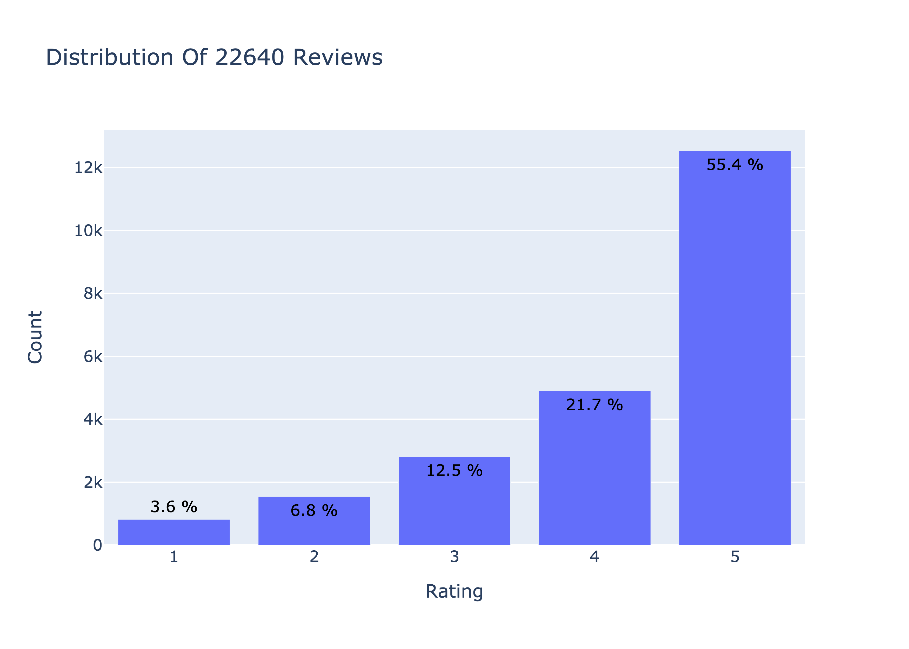
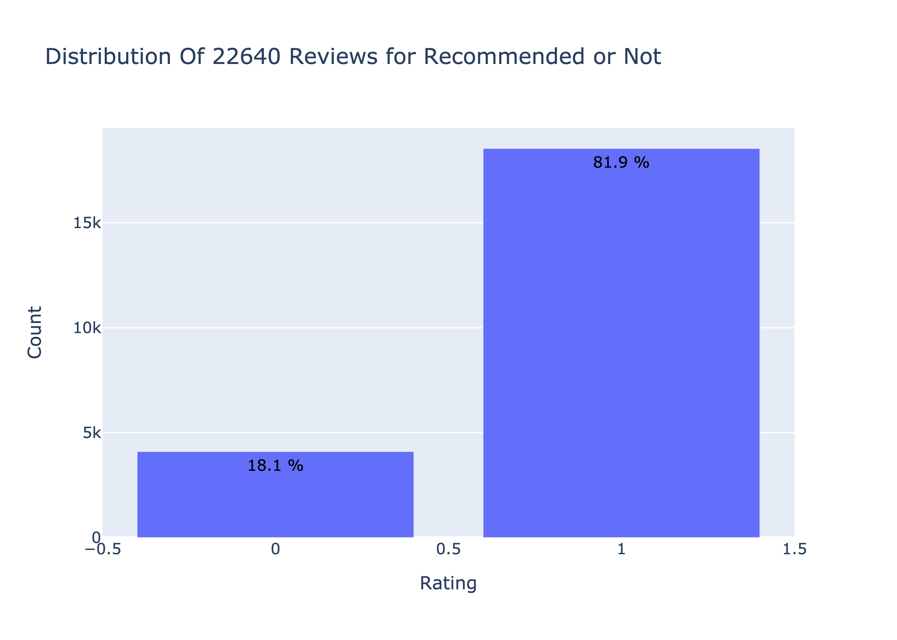
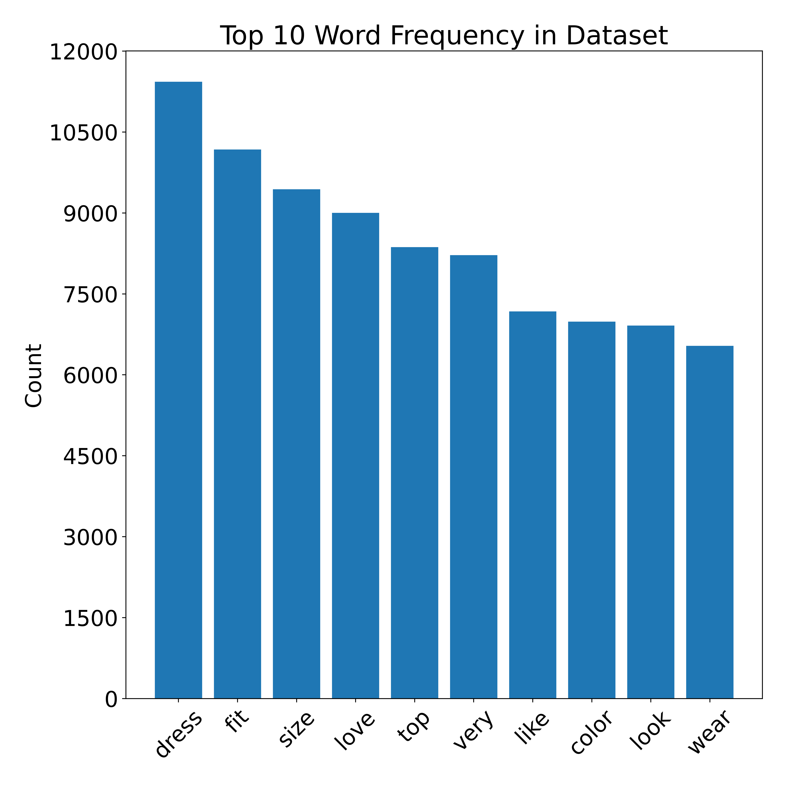
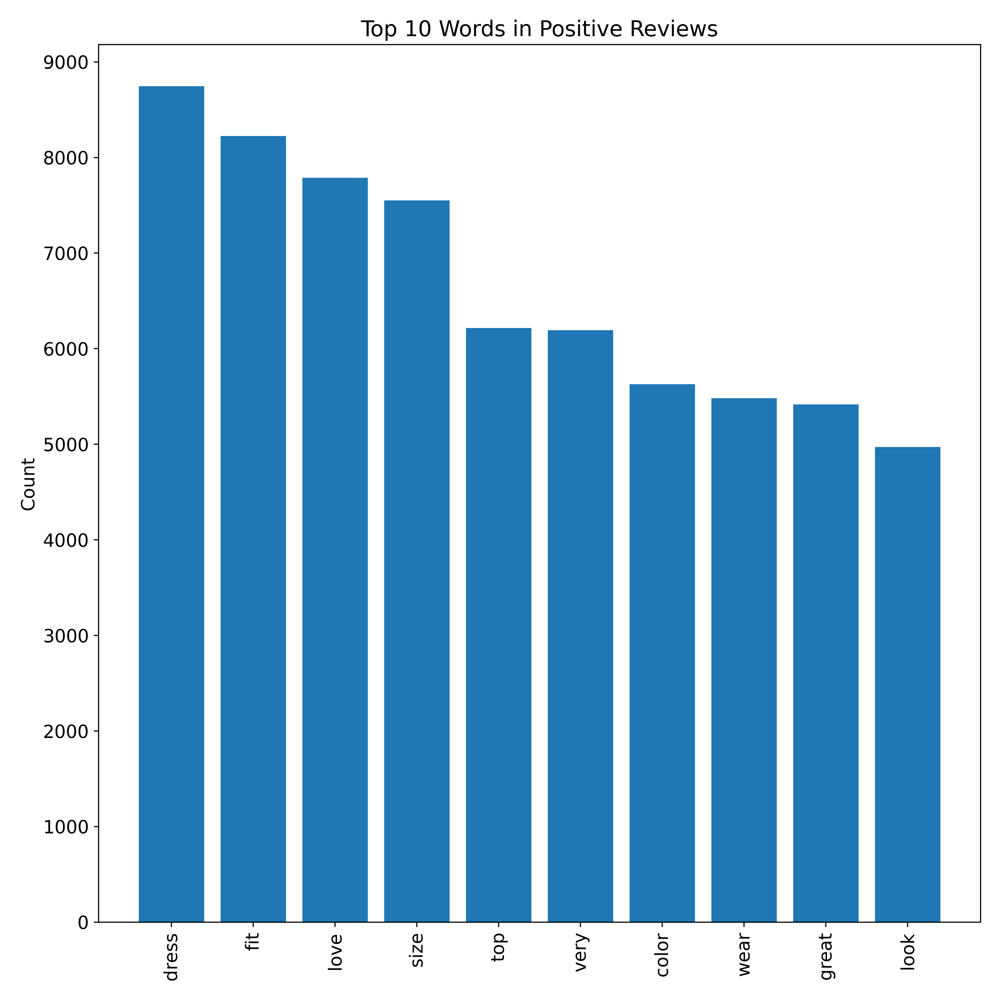
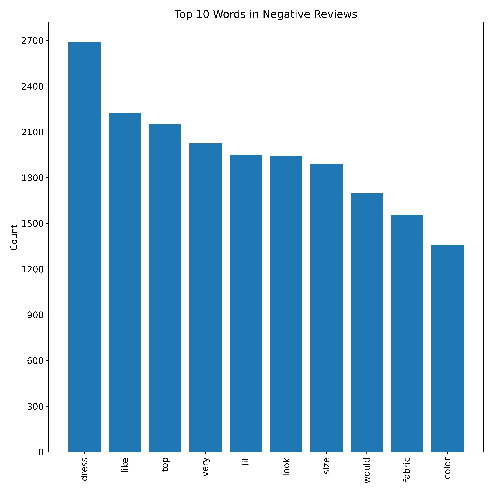
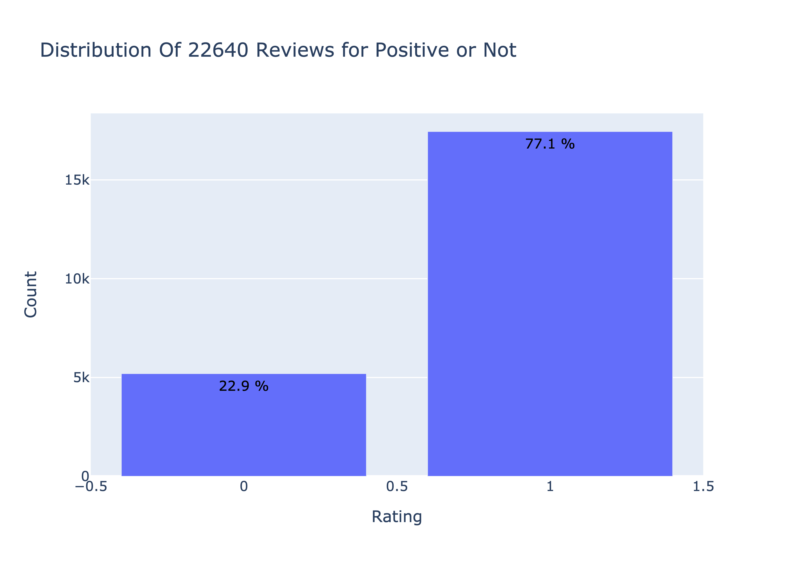
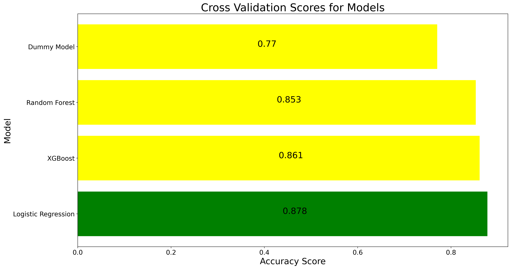
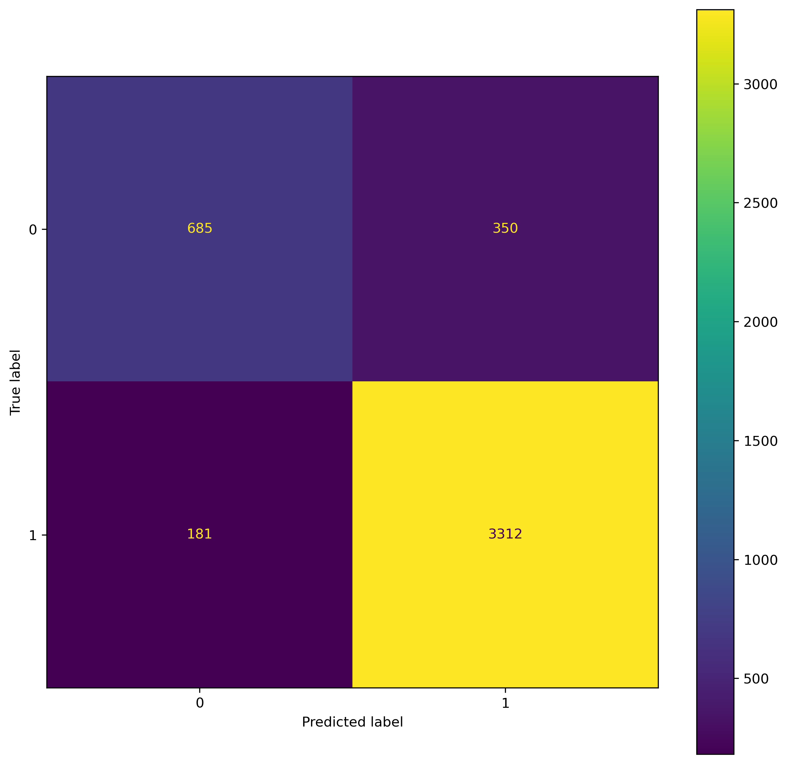

# Using NLP to Identify Positive and Negative Tweets for Women's Fashion Brands
Author: Jillian Clark

## Overview
For the purpose of this project, I am a Data Scientist contractor working with different Women's Fashion Brands, such as Zara and Aerie. This project aims to create a generalizable classification model to identify customer comments as having negative or positive sentiment.For demonstration purposes, I will utilize my model to classify tweets as positive or negative so the customer service teams can respond appropriately, such as responding to customer concerns in negative tweets and retweeting positive tweets. The model can be expanded to classify comments on Instagram, message boards, fashion blogs, etc.

## Business Problem
Natural language processing (NLP) has proved to be a highly effective technology for companies to save time and money while optimizing business processes. One of the major benefits of natural language processing for businesses is the ability to process massive volumes of text across varioius outlets, such as social media platforms, blogs, comments, and so on. By utilizing a machine learning model to classify text as positive or negative, businesses can send the comments to the appropriate teams, such as Quality Assurance for negatively sentimented comments or Marketing for positively sentimented comments. Generalizability is important with the constant evolution of technology, social media, and how users choose to interact with products and brands. While one brand may receive lots of tweeets, another brand may be discussed more in the comments of their Instagram posts.

### Use Cases
Positive Comments
- Retweet or repost from the Brand account
- Respond to boost that comment and reach more viewers
- Identify positive trends, such as colors or fit types, that multiple users are responding to
- Improve brand loyalty 

Negative Comments
- Respond to help customers feel heard and solve any fixable issues
- Identify issues with items before next drops, such as colors not photographing accurately on website or quality issues with fabric
- Improve brand loyalty 

## Data Understanding
Data for this project was pulled from a compiled dataset of Women's E-Commerce Clothing Reviews compiled in one CSV file. The dataset can be found [here](https://www.kaggle.com/datasets/nicapotato/womens-ecommerce-clothing-reviews). 

The review data contained 23,486 reviews. Additional variables included Clothing ID, Age, Title (of the review if there was one), Review Text, Rating, Recommended IND (whether or not the customer recommends a product), Positive Feedback Count (number of other customers who found the review positive), Division Name (categorical name of product high-level division), Department Name, and Class Name. Reviews ranged on a scale of 1-5. A majority of reviews received an overall rating of 5, which could be a limitation to the model. 



A majority of reviews also recommended the product.



Upon analysis, I also noticed some users either had a positive rating (4 or 5) but did NOT recommend the product, or recommended the product but did not have a positive rating (1-3). This could be due to user error and incorrectly using the rating system, or some users who had a personal negative review but would still recommend the product for others. If I had more time, I may run my model utilizing Recommended_IND as my target and see how my results change. 

**Below is an example of reviews where the rating and recommendedIND did not match up.

### Why utilize data from Reviews?
Reviews left by customers contain both text reivews (the meat of the review) in conjunction with a rating. By utilizing reviews as my source, I am able to easily assign a label of Positive_Sentiment (0 being false, 1 being true) to the review text based on the rating. This helps my model learn what words are associated with a positive sentiment and what words may be more associated with a negative sentiment. I can then apply this model to texts that are not accompanied by a number rating, such as tweets, Instagram captions, blog posts, and more.

## Data Preparation
The initial data source did not require too much cleaning. I removed 845 entries, which made up approxmiately 3.6% of m data, because they did not include any review text. I then went on to preprocess the review text so it could be used in a model. My preprocessing steps included: tokenizing my text (breaking the reviews into separate words), removing stopwords (common words in the English language that appear often and do not carry much weight when deciding sentiment), lower casing, removing punctuation and strings with non-alphabetic properties, and finally lemmatizing text.

After preprocessing, here are the top 10 words by frequency of my reviews:



Here are the top 10 words of positvely-sentimented reviews:



Here are the top 10 words of negatively-sentimented reviews:



I created two separate datasets, one with additional stop words removed and one that did not remove any additional stop words. 

[Here](./working_notebooks/data_exploration_notebook.ipynb) you can find my notebook that goes through the process of adding additional stop words. Additional stop words added include ['dress', 'fit', 'top', 'size', 'very', 'look', 'like', 'color', 'love', 'small']. As we can see, many of these stop words are generally related to how we talk about clothes and may have different meanings depending what word comes in front of or after them like "fits well" versus "does not fit."

I found that my dataset that did not add any additional stop words to the preprocessing steps regulary performed better. This may be explained by my model looking at both unigrams and bigrams, meaning my model looks at both single words and word pairings, like "fit," and "not fit." 

Below is a WordCloud visuallizing the frequency of all words in the dataset.


The target variable for the model is Positive_Rating. I created this variable utilizing the Rating column with a rating of 4-5 being classified as 1 and a rating of 1-3 being classified as 0. The only variable needed for my model is Review_Text, which could come from any source. Like the distribution for ratings, the distribution for my target is a bit skewed.



## Methods

I utilized a Dummy Classifer for the initial model, which returned an accuracy score of of 77% by predicting the majority label for each observation. I iterated through the following model algorithms to assess which models to further explore: MultinomialNB(), LogisticRegression(), KNeighborsClassifier(), DecisionTreeClassifier(), XGBoost(), and RandomForestClassifier(). The results were based on cross validation and returning the accuracy score for each model. The top 3 models according to accuracy were LogisticRegression(), XGBoost(), and RandomForestClassifier(). Based on these results, I chose those 3 models to explore further.

I ran multiple grid searchs to test hyperparameters for LogisticRegression(), XGBoost(), and RandomForestClassifier(). I ran multiple grid searches with both the dataset without additional stop words and with additional stop words to see which dataset produced better results. My dataset without additional stop words removed produced better results on all models. I utilized my dataset without additional stop words as my final dataset to compare all models with the final dataset. XGBoost() and RandomForestClassifier() models performed well on my training data, but continuted to be overfit; the results were significantly worse utilizing cross validation. While Logistic Regression models did not perform as well on training data, these models produced the best results utililzing cross validation. 

Below is a comparison of the cross validation accuracy scores across models:



## Final Model/Evaluation

The best model based on cross validation scores is a Logistic Regression Pipeline with the following hyperparameters tuned:
- For TfidVectorizer: max_df=.35, max_features=3000, ngram_range=(1,2)
- For LogisisticRegression: solver='lbfgs', C=3, max_iter=30

The final model using Logistic Regression yielded an accuracy score of 88.27% on unseen data, meaning it correctly classified unseen data as positive or not positive over 88% of the time. The initial Dummy Classifier performed with a 77.04% accuracy, meaning I was able to improve accuracy by over 11% by utilizing and tuning a more complex model. From the confusion matrix, we can see that the model misclassified reviews that were not positive as positive almost twice as much as classified reviews that were positive as not positive. This imbalance may be explained by our starting class imbalance. 



## Classifying New Data

Prior to running the inputed data through the model, a function will perform text preprocessing steps. 

In order to obtain new data, I utilized Twitter's API and made API calls to obtain tweets that were related to women's clothing items. Specifically, I made queries directed @ZARA and @h&m that included words such as "dress," "shirt," and "clothing." I then ran these tweets through a preprocessing function so they could be run through my model. My model is able to return a classification for each tweet along with probability of each class (0 or 1). 

## Limitations
While the final model optimizes accuracy of predicted sentiment of comments, it has its limitations. 

- Class Imbalance: almost 80% of the reviews were coded as "positive" based on a rating of 4 or 5
- Time to run models: running multiple GridSearchCV fits can take hours if not days
- User error when rating items: based on some of the reviews, it appears as though users may have mixed up the ratings and utilized 1 for positive reviews or 5 for negative reviews

## Next Steps

## Conclusion

In conclusion, using my generalizable model will allow women's fashion brand companies to feed comments from any web source to identify positively and negatively sentiment comments and respond appropriately. Utilizing the model will allow companies to save time and by flagging the comments for appropriate teams to respond to, such as Quality Assurance to respond to negative comments, or marketing to respond to and promote positive comments. Responding to these comments appropriately will improve products by identifying potential clothing quality issues if the same sentiment is being repeated, identify potential positive trends, boost visability by responding to comments, and improve brand loyalty by making customers feel heard.

## Repository Structure
```
├── data
│   ├── Womens Clothing E-Commerce Reviews 2.csv
│   ├── bigram_data.csv
│   ├── final_data.csv
│   ├── single_word_data.csv
│   ├── tweet_dataset.csv
├── images
│   ├── final_confusion_matrix.png
│   ├── model_accuracy_scores.png
│   ├── recommendedIND_distribution.png
│   ├── reviews_distribution.png
│   ├── target_distribution.png
│   ├── top_10_negative_word_frequency.png
│   ├── top_10_positive_word_frequency.png
│   ├── top_10_word_frequency.png
├── working_notebooks
│   ├── data_exploration_notebook.ipynb
│   ├── data_modeling_rating_prediction.ipynb
│   ├── data_modeling_sentiment_prediction.ipynb
│   ├── data_no_additional_stopwords.ipynb
│   ├── model_with_tweets.ipynb
│   ├── twitter_api_exploration.ipynb
├── .gitignore
├── LICENSE
├── README.md
├── final_data_prep.ipynb
├── final_model_tuning.ipynb
├── final_model_with_tweets.ipynb
```
